# 🛡 SOC Investigation — Azuki Import/Export
### Microsoft Defender for Endpoint | Microsoft Sentinel | KQL Threat Hunting

---

## 🏅 Professional Badges


---

## 🧠 Overview

This repository documents a full attack lifecycle reconstruction conducted in a live Azure SOC lab environment using:

- Microsoft Defender for Endpoint (Advanced Hunting)
- Microsoft Sentinel (SIEM)
- KQL (Kusto Query Language)
- Structured SOC investigation methodology
- MITRE ATT&CK framework alignment

The investigation reconstructed a multi-stage intrusion from initial access through lateral movement and persistence.

This project demonstrates practical SIEM engineering, threat hunting, detection logic, and attack chain analysis.

---

## 🎯 Incident Summary

**Target System:** AZUKI-SL (IT Admin Workstation)
**Initial Access Vector:** RDP (RemoteInteractive Logon)
**Compromised Account:** kenji.sato
**External IP:** 88.97.178.12

The attacker successfully:

- Gained RDP access
- Conducted network discovery (arp -a)
- Created hidden staging directory
- Modified Windows Defender exclusions
- Downloaded malware via certutil.exe (LOLBIN)
- Established scheduled task persistence
- Performed LSASS credential dumping
- Archived data (export-data.zip)
- Exfiltrated data via Discord (HTTPS)
- Cleared Security logs
- Created backdoor admin account
- Attempted lateral movement

Full lifecycle confirmed through enterprise telemetry.

---

## 🕒 Attack Timeline

| Phase | Activity |
|-------|----------|
| Initial Access | RDP from 88.97.178.12 |
| Discovery | ARP network enumeration |
| Defense Evasion | Hidden folder + Defender exclusions |
| Execution | certutil.exe download of svchost.exe |
| Persistence | Scheduled task "Windows Update Check" |
| Credential Access | LSASS memory dump via mm.exe |
| Collection | export-data.zip archive created |
| Exfiltration | Discord over HTTPS |
| Anti-Forensics | wevtutil.exe cleared Security logs |
| Lateral Movement | mstsc.exe to 10.1.0.188 |

See `/docs/timeline.md` for full breakdown.

---

## 🎯 Visual Attack Chain Overview



```mermaid
flowchart LR
A[Initial Access<br>RDP T1021.001] --> B[Discovery<br>ARP Recon T1046]
B --> C[Defense Evasion<br>Defender Tampering T1562]
C --> D[Execution<br>certutil LOLBin T1105]
D --> E[Persistence<br>Scheduled Task T1053]
E --> F[Credential Access<br>LSASS Dump T1003]
F --> G[Collection<br>Archive Data T1560]
G --> H[Exfiltration<br>Discord HTTPS T1567]
H --> I[Anti-Forensics<br>Clear Logs T1070]
I --> J[Lateral Movement<br>RDP T1021]
```

This diagram represents the reconstructed attack progression using enterprise telemetry.

---

## 🔍 Detection Engineering Highlights

### 🧾 KQL Hunting Queries Used

The investigation relied on structured KQL hunts across both endpoint and SIEM telemetry:

- **DeviceLogonEvents** – RDP authentication analysis and compromised account identification
- **DeviceProcessEvents** – LOLBin abuse, scheduled task creation, PowerShell execution
- **DeviceRegistryEvents** – Windows Defender exclusion tampering detection
- **DeviceNetworkEvents** – C2 traffic and exfiltration analysis
- **SigninLogs (Sentinel)** – Identity anomaly validation
- **SecurityEvent** – RDP logon and authentication pattern analysis

Reusable queries are available in the `/queries/` directory.

---

## 📊 Detection Coverage Matrix

| ATT&CK Tactic | Technique | Detection Source | Coverage Status |
|---|---|---|---|
| Initial Access | T1021.001 – RDP | DeviceLogonEvents | ✅ Confirmed |
| Discovery | T1046 – Network Recon | DeviceProcessEvents | ✅ Confirmed |
| Defense Evasion | T1562 – Modify Defender | DeviceRegistryEvents | ✅ Confirmed |
| Execution | T1105 – Ingress Tool Transfer | DeviceProcessEvents | ✅ Confirmed |
| Persistence | T1053 – Scheduled Task | DeviceProcessEvents | ✅ Confirmed |
| Credential Access | T1003 – LSASS Dump | DeviceProcessEvents | ✅ Confirmed |
| Collection | T1560 – Archive Data | DeviceProcessEvents | ✅ Confirmed |
| Exfiltration | T1567 – Web Service | DeviceNetworkEvents | ✅ Confirmed |
| Anti-Forensics | T1070 – Clear Logs | DeviceProcessEvents | ✅ Confirmed |
| Lateral Movement | T1021 – Remote Services | DeviceLogonEvents | ⚠ Attempted |

---

## ⚙️ Key Technical Findings

### 🛡 Defender Tampering

The attacker modified Windows Defender exclusion registry keys to bypass detection and excluded the local Temp directory from scanning.

This allowed malicious payloads to execute without AV inspection.

---

### 🧨 LOLBin Abuse

`certutil.exe` was used to download a malicious payload from an external host.

This demonstrates Living-Off-the-Land Binary (LOLBIN) abuse to evade traditional detection mechanisms.

---

### ♻ Persistence Mechanism

A scheduled task was created:

`Windows Update Check`

The task executed a malicious payload at user logon with SYSTEM privileges.

This provided reliable persistence across reboots.

---

### 🔐 Credential Dumping

The attacker deployed a credential theft tool:

`mm.exe`
`sekurlsa::logonpasswords`

This indicates LSASS memory dumping to extract plaintext credentials and authentication material.

---

### 📦 Data Staging & Archive Creation

Stolen files were compressed into:

`export-data.zip`

This archive was prepared for outbound exfiltration.

---

### 🌐 Data Exfiltration

Data was transmitted via Discord over HTTPS (port 443), blending malicious traffic with legitimate encrypted web traffic.

---

### 🧹 Anti-Forensics

Security logs were cleared using:

`wevtutil.exe cl Security`

This action attempted to erase authentication and privilege escalation evidence.

---

## 📂 Repository Structure

```text
docs/
├── report.md
├── timeline.md
├── mitre-mapping.md
├── iocs.md
└── query-pack.md

queries/
├── mde/
└── sentinel/

assets/
└── screenshots/
```


---

## 🧠 Skills Demonstrated

- Threat Hunting (Microsoft Defender for Endpoint + Sentinel)
- KQL Query Development
- Attack Lifecycle Reconstruction
- Windows Internals & Process Tree Analysis
- Persistence & Credential Theft Detection
- MITRE ATT&CK Mapping
- IOC Extraction & Documentation
- Log Tampering Detection
- Detection Engineering Workflow

---

## 🏆 Professional Context

This investigation was conducted in a live Azure SOC environment using enterprise telemetry.

All findings were documented using structured SOC methodology and aligned to MITRE ATT&CK.

---

## 🚀 Planned Enhancements

- Convert hunts into Sentinel Analytics Rules
- Build automated detection dashboards
- Add incident response playbook
- Add IOC export automation
